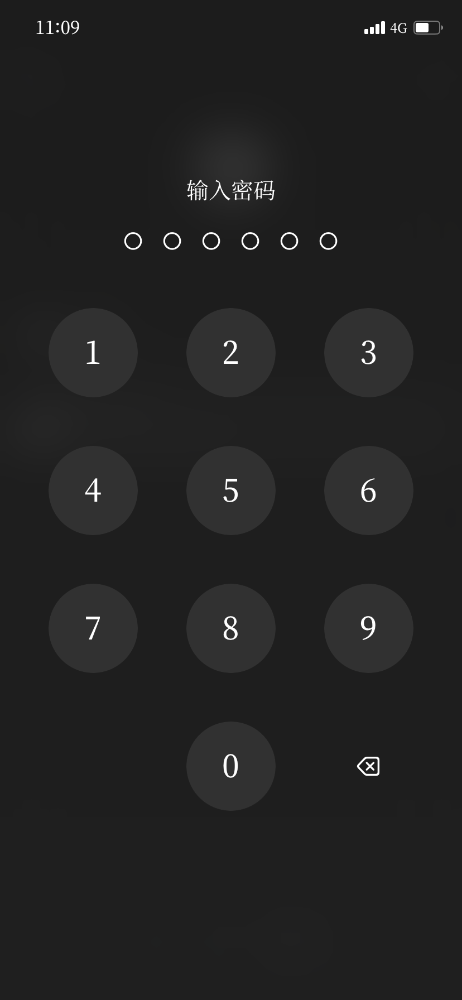
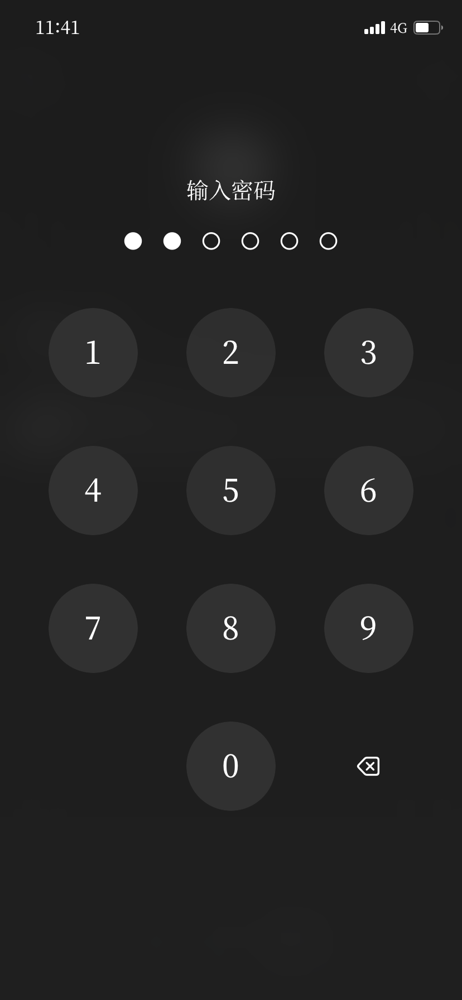
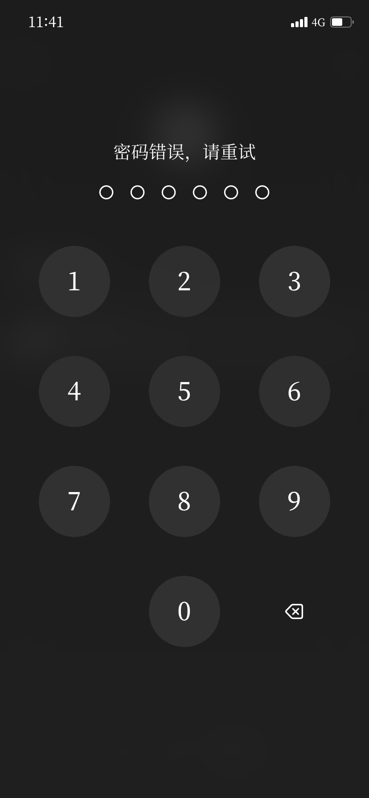

# app-secure-lock

[](LICENSE)

**app-secure-lock** is a universal app lock tool developed based on Theos, suitable for the TrollStore environment. It locks an app by injecting a dynamic library (dylib) into the target app and uses the current date as the password. For example, if today is February 26, 2025, the password would be `250226`.

## Features

- **Dynamic Library Injection**: Injected into the target app as a dylib, without modifying the original code of the app.
- **Time-Based Password**: Uses the current date as a dynamic password in the format `YYMMDD`.
- **TrollStore Compatibility**: Specifically designed for the TrollStore environment, supporting unsigned apps.
- **Lightweight and Efficient**: Simple code with low resource usage.

## Use Cases

- Protect sensitive apps to prevent unauthorized access.
- Temporarily lock an app with a dynamically generated password based on time.
- Learn and research iOS dynamic library injection techniques.

## Installation and Usage

### Prerequisites

- The [Theos](https://theos.dev/) development environment is installed.
- The device has TrollStore installed.
- The target app supports dylib injection.

### Installation Steps

1. Clone this repository:
   ```bash
   git clone https://github.com/jiangdequan/app-secure-lock.git
   cd app-secure-lock
   ```
2. Build the project:
   ```bash
   // dylib
   make clean && make
   // deb
   make clean && make package
   ```
3. Inject the generated .dylib file into the target app (for injection methods, refer to the TrollStore documentation).

### Usage
1. When launching the target app, a password input dialog will pop up.
2. Enter the password based on the current date in the format YYMMDD. For example, if today is February 26, 2025, enter 250226.
3. If the password is correct, the app will be unlocked.

## Actual Running Effects
### Main Interface


### Password Input


### Unlock Failed


## Code Structure
```
app-secure-lock/
├── Makefile              # Theos build configuration
├── Tweak.xm              # Main logic code
├── control               # Package information
├── LICENSE               # Open-source license
└── README.md             # Project documentation
```

## Contribution Guidelines
Feel free to submit Issues and Pull Requests! Please ensure consistent code style and provide detailed descriptions.

## License
This project is open-source under the [MIT License](https://mit-license.org/).

## References
* [Theos Official Documentation](https://theos.dev/)
* [TrollStore Usage Guide](https://github.com/opa334/TrollStore)
* [Ruanyifeng's README Style Guide](https://www.ruanyifeng.com/blog/2016/10/style_guide_for_technical_writing.html)